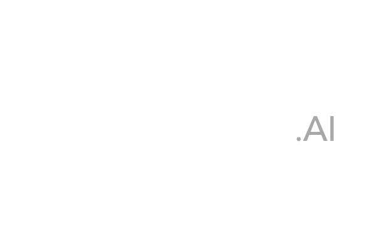

# hippo7

This is Luminovo's template repository.

## Mkdocs Material

This is an example doc, using the [mkdocs material theme](https://squidfunk.github.io/mkdocs-material/).

### Images
It supports images out of the box like so:

### Tables
It also supports tables:

First Header | Second Header | Third Header
------------ | ------------- | ------------
Content Cell | Content Cell  | Content Cell
Content Cell | Content Cell  | Content Cell

### More

For more information have a look [here](https://www.mkdocs.org/user-guide/writing-your-docs/).

!!! note
    This is an example note.
    

